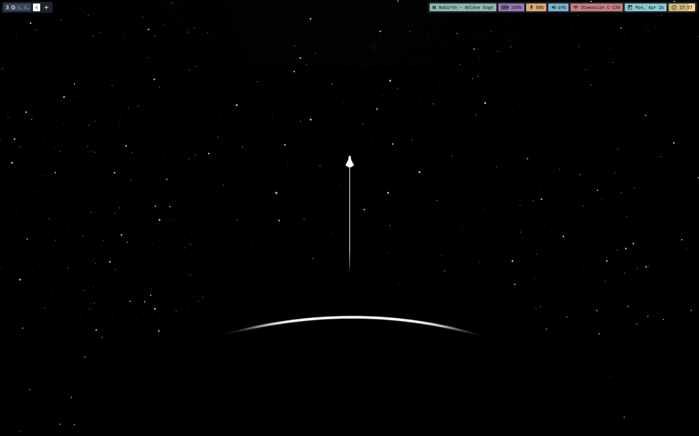
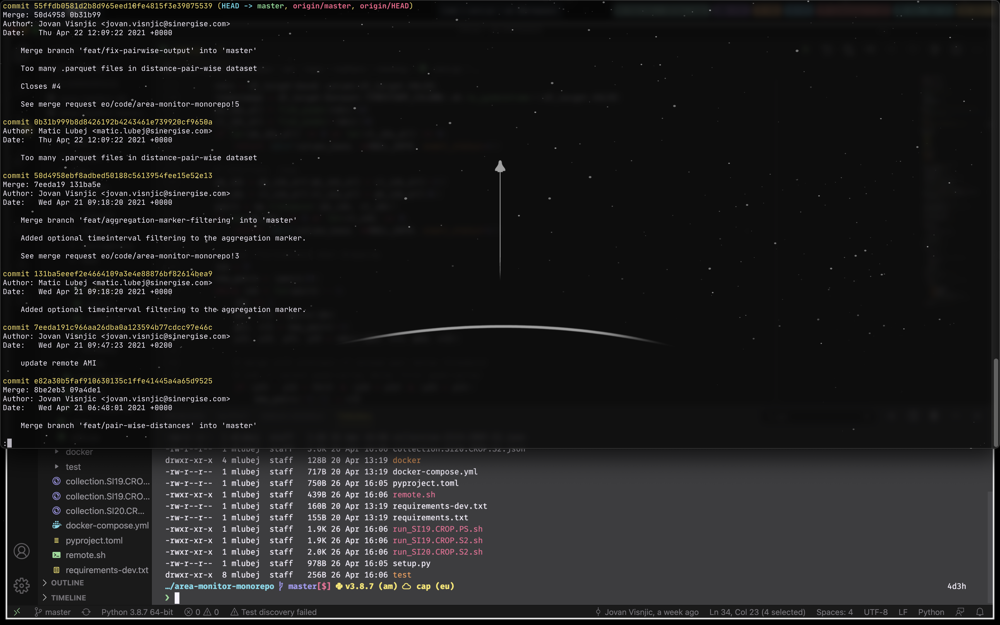

## Setup

- OS: macOC Big Sur
- shell: `zsh` wih [oh-my-zsh](https://ohmyz.sh) plugins ([zsh-users](https://github.com/zsh-users)) and [starship](https://starship.rs) prompt
- Color Theme (shell and `vscode`): [monokai-pro](https://monokai.pro)
- WM: [yabai](https://github.com/koekeishiya/yabai) + [skhd](https://github.com/koekeishiya/skhd)
- Bar: [simple-bar](https://www.simple-bar.com/en/)
- DE: Aqua (default)
- Terminal: [iterm2](https://iterm2.com) (with an extra guake-like dropdown profile)
- Music: [spotify-tui](https://github.com/Rigellute/spotify-tui)
- Text font: `JetBrainsMonoNerdFont`
- Icons font: `HackNerdFont`
- Wallpaper: [Minimalist Space](https://www.reddit.com/r/wallpapers/comments/ccpkdj/minimalist_space_3840x2160/) (edited to remove some artifact)
- Workflow video: [link](https://imgur.com/a/b5dpNAJ)

## Screenshots

## Workflow

<blockquote class="imgur-embed-pub" lang="en" data-id="a/VpE4uQ4" data-context="false" ></blockquote>

