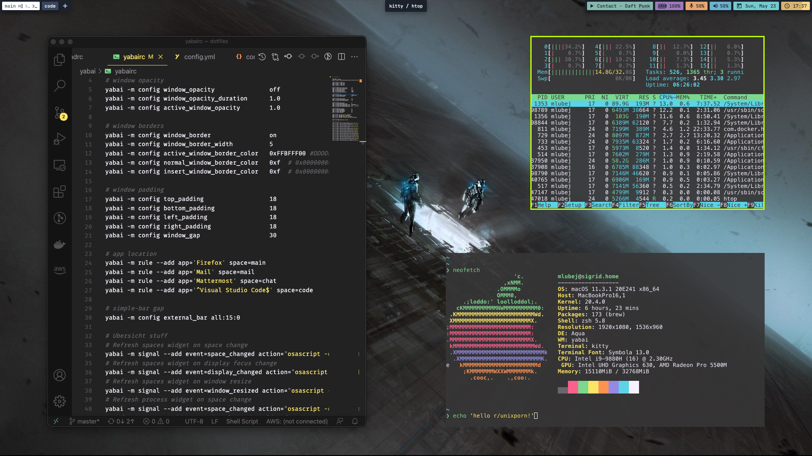
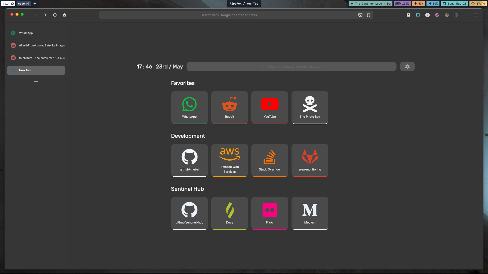

## Setup

- OS: macOC Big Sur
- Shell: `zsh` wih [oh-my-zsh](https://ohmyz.sh) plugins ([zsh-users](https://github.com/zsh-users)) and [starship](https://starship.rs) prompt
- Color Theme (shell and `vscode`): [monokai-pro](https://monokai.pro)
- WM and shortcuts: [yabai](https://github.com/koekeishiya/yabai) + [skhd](https://github.com/koekeishiya/skhd)
- Key mapping: [Karabiner-Elements](https://karabiner-elements.pqrs.org/)
- Bar: [simple-bar](https://www.simple-bar.com/en/)
- DE: Aqua (default)
- Terminal: [kitty](https://sw.kovidgoyal.net/kitty/)
- Dropdown Terminal: [iterm2](https://iterm2.com)
- Music: [spotify-tui](https://github.com/Rigellute/spotify-tui)
- Text font: `JetBrainsMonoNerdFont`
- Icons font: `HackNerdFont`
- [Wallpaper](hhttps://www.wallpaperflare.com/minimalism-spacesuit-science-fiction-real-people-two-people-wallpaper-hiopk)
- Firefox stuff:
  - [FlyingFox](https://github.com/akshat46/FlyingFox) theme
  - [nightTab](https://github.com/zombieFox/nightTab) landing page
  - [TreeStyleTab](https://github.com/piroor/treestyletab) extension for tree-style tabs sidebar

## Screenshots

